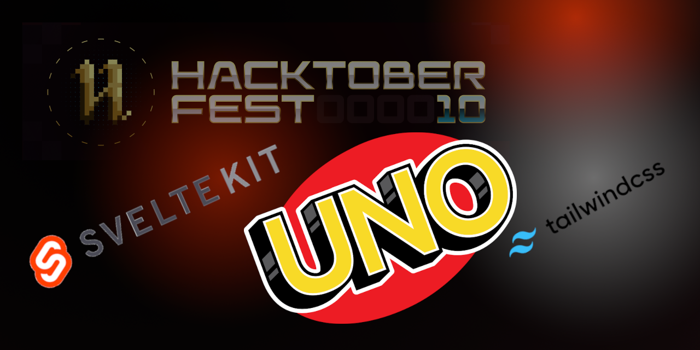

# SvelteKit Uno Game



Here is the structure for this project:

We hop to build a simple Uno game using SvelteKit. This will demonstrate basic card handling, game logic, and multiplayer capabilities. We will use TailwindCSS for styling and Socket.io for multiplayer.

---

Here is the structure for this project:


Game Loop:

## Getting Started

Clone the repository and install the dependencies.

```bash
git clone https://github.com/timscodebase/uno.git
cd uno
npm install  // or pnpm install
```

### Prerequisites

- You will need to have Node.js installed on your machine. You can download it from [here](https://nodejs.org/en/download/).
- You will need to have a GitHub account. You can create one [here](https://github.com/).
- [PnPm](https://pnpm.io/) is not required, but greatly improves proformance. You can install it with `npm install -g pnpm`.

#### Hacktoberfest 2023

This repository is for Hacktoberfest 2023. Join us in creating a fun game for everyone to play while learning about SvelteKit, TailwindCSS and Socket.io.

# 🚀 SvelteKit Uno Game

Welcome to the SvelteKit Uno Game project! 🃏 Get ready to dive into the world of Uno with an exciting twist. We're bringing you a simple yet thrilling Uno game built with SvelteKit, featuring card handling, game logic, and multiplayer capabilities. Plus, we're spicing it up with sleek styling using TailwindCSS and real-time multiplayer action powered by Socket.io. 🎉

## Project Snapshot 📸

Take a sneak peek at the project structure:

Project Structure


Ready to jump into the action? Check out our game's vibrant user interface:

Start - Begin the Uno adventure by setting up your game.


Game Loop 🔄
Here's a quick overview of our game loop:


Play - Dive into the Uno frenzy, strategize, and aim for victory!

Clone the repository to your local machine:

```bash
git clone <https://github.com/timscodebase/uno.git>
cd uno
```

Install the project dependencies:

```bash
npm install  # or pnpm install for blazing-fast performance 🚀
```

This will install all required dependencies.

## Prerequisites 📋

Before you embark on this Uno journey, make sure you have the following:

Node.js - Ensure you have Node.js installed on your machine. If not, you can download it here.
GitHub Account - You'll need a GitHub account to get involved. Don't have one yet? Create an account here.
PnPm (Optional) - While not mandatory, installing PnPm can significantly boost performance. Install it with npm install -g pnpm.

### 🎉 Hacktoberfest 10 🎉

This repository is your passport to Hacktoberfest 10! Join us in crafting a thrilling game that's not only loads of fun but also a fantastic learning opportunity. Discover the magic of SvelteKit, the elegance of TailwindCSS, and the excitement of Socket.io while contributing to this project. Let's make Hacktoberfest unforgettable together! 🌟

Feel free to use this enhanced README.md for your project to make it more engaging and inviting to potential contributors and users.
